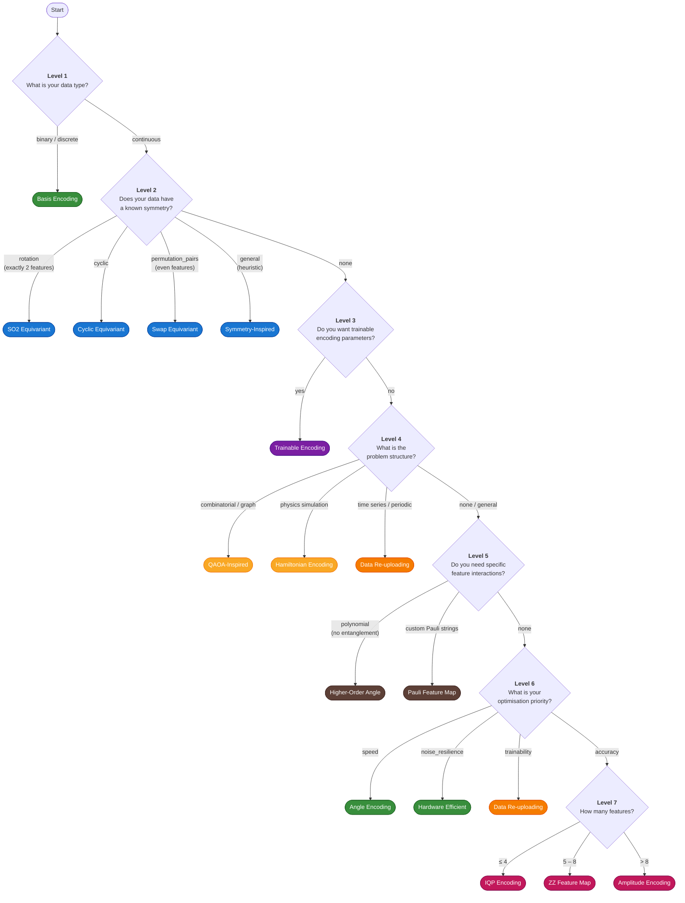

# Decision Flowchart

A visual guide to selecting a quantum encoding. Start at the top and follow the arrows — every one of the 16 encodings is reachable.

!!! info "This flowchart mirrors `EncodingDecisionTree.decide()`"
    The flowchart below is a 1:1 representation of the deterministic decision tree implemented in `encoding_atlas.guide.decision_tree`. For the scored recommendation engine (which returns alternatives and confidence), see [Recommendation Architecture](recommendation-architecture.md).

---

## The Flowchart



!!! note "Data Re-uploading has two paths"
    `data_reuploading` is reachable via **two** distinct routes: `problem_structure="time_series"` (Level 4) and `priority="trainability"` (Level 6). All other encodings have exactly one path.

---

## Colour Legend

| Colour | Category | Encodings |
|:-------|:---------|:----------|
| :green_square:{ .md-color } Green | Simple / shallow | Basis, Angle, Hardware Efficient |
| :blue_square:{ .md-color } Blue | Symmetry-aware | SO2, Cyclic, Swap Equivariant, Symmetry-Inspired |
| :purple_square:{ .md-color } Purple | Learnable | Trainable |
| :yellow_square:{ .md-color } Yellow | Domain-specific | QAOA-Inspired, Hamiltonian |
| :orange_square:{ .md-color } Orange | Deep / expressive | Data Re-uploading |
| :brown_square:{ .md-color } Brown | Feature interaction | Higher-Order Angle, Pauli Feature Map |
| :red_square:{ .md-color } Pink | Accuracy / kernel | IQP, ZZ Feature Map, Amplitude |

---

## Quick Reference Table

| Level | Condition | Encoding | Key Tradeoff |
|:------|:----------|:---------|:-------------|
| 1 | Binary / discrete data | Basis | Simple but limited to discrete inputs |
| 2 | Rotational symmetry (2 features) | SO2 Equivariant | Rigorous 2D rotation equivariance |
| 2 | Cyclic symmetry | Cyclic Equivariant | Ring-topology Z_n shift symmetry |
| 2 | Permutation pairs (even features) | Swap Equivariant | Rigorous S_2 pair-swap symmetry |
| 2 | General symmetry | Symmetry-Inspired | Heuristic symmetry inductive bias |
| 3 | Trainable parameters desired | Trainable | Learnable but needs optimisation budget |
| 4 | Combinatorial / graph problem | QAOA-Inspired | Cost-mixer structure for optimisation |
| 4 | Physics simulation | Hamiltonian | Trotterised time evolution, deep circuits |
| 4 | Time series / periodic data | Data Re-uploading | Universal approximation, deep circuits |
| 5 | Polynomial interactions (no entanglement) | Higher-Order Angle | Order-k products, classically simulable |
| 5 | Custom Pauli string rotations | Pauli Feature Map | Flexible but complex to configure |
| 6 | Priority = speed | Angle | O(1) depth, no entanglement, no barren plateaus |
| 6 | Priority = noise resilience | Hardware Efficient | Native gates, low CNOT count |
| 6 | Priority = trainability | Data Re-uploading | Universal approximation via repeated encoding |
| 7 | Priority = accuracy, ≤ 4 features | IQP | Provably hard kernels, full entanglement |
| 7 | Priority = accuracy, 5–8 features | ZZ Feature Map | Standard pairwise feature interactions |
| 7 | Priority = accuracy, > 8 features | Amplitude | Exponential compression, logarithmic qubits |

---

## Programmatic Usage

The flowchart above corresponds exactly to `EncodingDecisionTree.decide()`:

```python
from encoding_atlas.guide import EncodingDecisionTree

tree = EncodingDecisionTree()

# Example: continuous data, no symmetry, accuracy priority, 6 features
result = tree.decide(
    data_type="continuous",
    n_features=6,
    priority="accuracy",
)
print(result)  # "zz_feature_map"
```

For ranked recommendations with confidence scores and alternatives, use the scored recommender instead:

```python
from encoding_atlas.guide import recommend_encoding

rec = recommend_encoding(
    n_features=6,
    priority="accuracy",
    hardware="simulator",
)
print(rec.encoding_name)   # Top pick
print(rec.alternatives)    # Up to 3 runners-up
print(rec.confidence)      # 0.50 – 0.95
```

!!! tip "Want the full details?"
    See [Recommendation Architecture](recommendation-architecture.md) for the complete scoring breakdown, weight hierarchy, confidence mapping, and worked examples.
