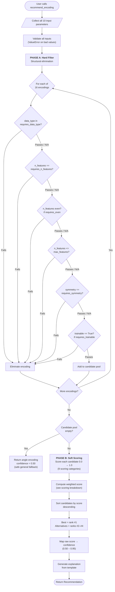
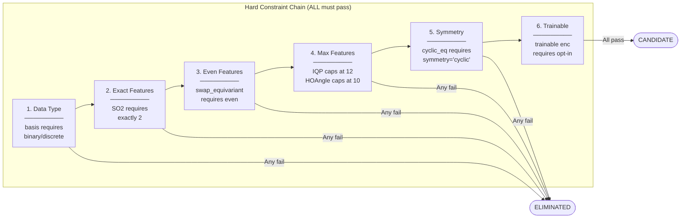
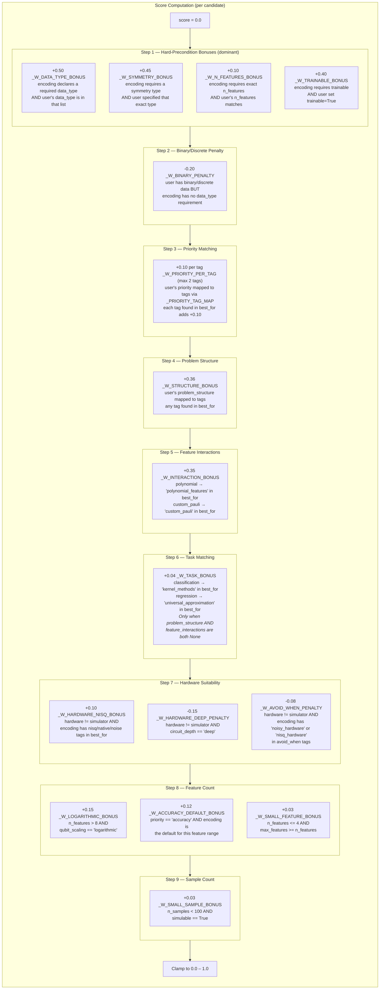
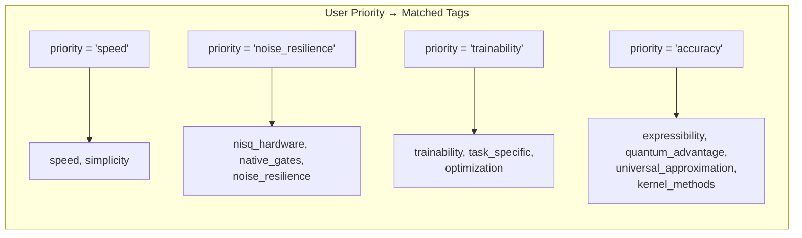
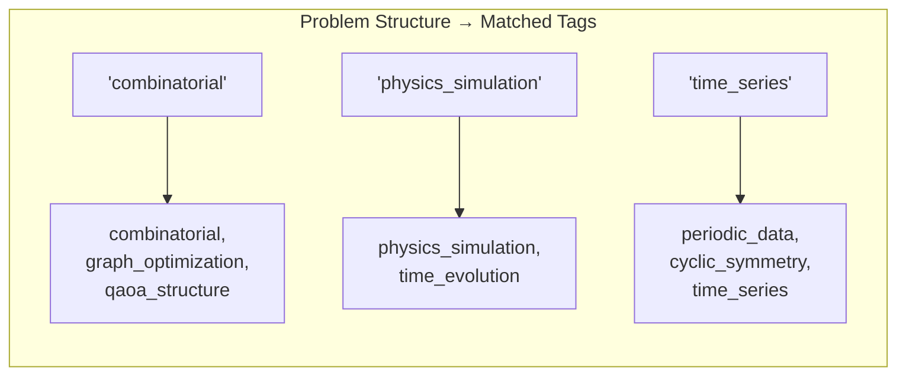
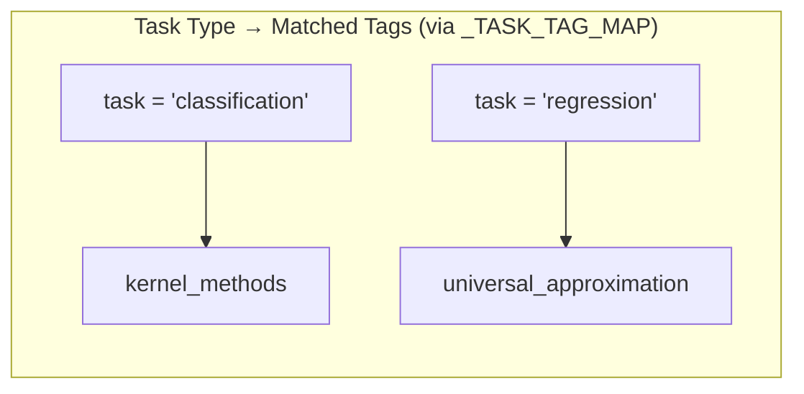
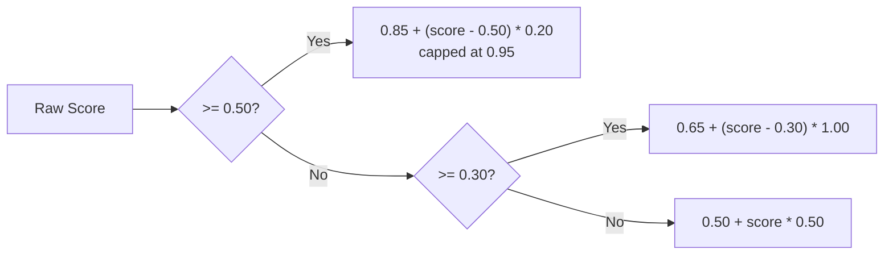
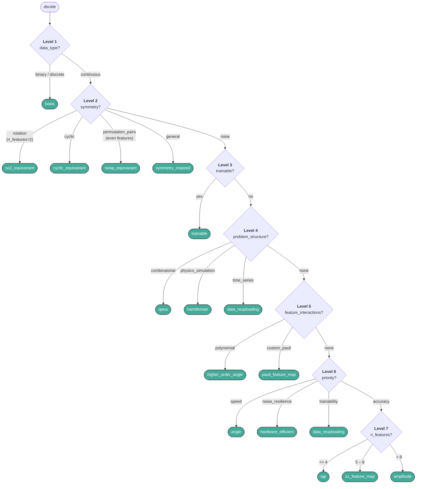

# Recommendation Engine Architecture

This page explains the internal architecture of the `recommend_encoding()` and `EncodingDecisionTree.decide()` systems — how they score, rank, and select encodings for your problem.

!!! tip "Looking for a quick recommendation?"
    If you just want to pick an encoding, see [Which Encoding?](which-encoding.md) or the [Decision Flowchart](decision-flowchart.md). This page is for understanding *how* the engine works under the hood.

---

## System Overview

```mermaid
flowchart LR
    subgraph INPUT["User Input"]
        direction TB
        I1["n_features"]
        I2["n_samples"]
        I3["task"]
        I4["hardware"]
        I5["priority"]
        I6["data_type"]
        I7["symmetry"]
        I8["trainable"]
        I9["problem_structure"]
        I10["feature_interactions"]
    end

    subgraph KB["Knowledge Base"]
        direction TB
        K1["ENCODING_RULES<br/>(16 encodings)"]
        K2["best_for tags"]
        K3["avoid_when tags"]
        K4["hard constraints"]
        K5["metadata"]
    end

    subgraph OUTPUT["Output"]
        direction TB
        O1["Recommendation"]
        O2["encoding_name"]
        O3["explanation"]
        O4["alternatives\[\]"]
        O5["confidence"]
    end

    INPUT --> KB --> OUTPUT
```



---

## Full Pipeline

The recommendation is produced in two phases, preceded by input validation.



---

## Phase A: Hard Constraint Filter

Each constraint is a **binary gate**. If any single gate fails, the encoding is eliminated regardless of everything else.



### Hard Constraints by Encoding

| Encoding | requires_data_type | requires_n_features | requires_even | max_features | requires_symmetry | requires_trainable |
|---|---|---|---|---|---|---|
| angle | -- | -- | -- | -- | -- | -- |
| basis | binary, discrete | -- | -- | -- | -- | -- |
| higher_order_angle | -- | -- | -- | 10 | -- | -- |
| iqp | -- | -- | -- | 12 | -- | -- |
| zz_feature_map | -- | -- | -- | 12 | -- | -- |
| pauli_feature_map | -- | -- | -- | 12 | -- | -- |
| data_reuploading | -- | -- | -- | 8 | -- | -- |
| hardware_efficient | -- | -- | -- | -- | -- | -- |
| amplitude | -- | -- | -- | -- | -- | -- |
| qaoa | -- | -- | -- | -- | -- | -- |
| hamiltonian | -- | -- | -- | -- | -- | -- |
| trainable | -- | -- | -- | -- | -- | YES |
| symmetry_inspired | -- | -- | -- | -- | general | -- |
| so2_equivariant | -- | 2 | -- | 2 | rotation | -- |
| cyclic_equivariant | -- | -- | -- | -- | cyclic | -- |
| swap_equivariant | -- | -- | YES | -- | permutation_pairs | -- |

!!! note
    **"--"** means no constraint (always passes).

---

## Phase B: Soft Scoring

After the hard filter, each surviving encoding gets a score built from **9 scoring categories** applied in sequence. Weights are extracted as named constants (`_W_*`) for tuning.



### Weight Hierarchy

```
Step 1 bonuses  (0.10 – 0.50)  ██████████████████████████  Structural match — "this encoding EXISTS for your use case"
Step 2 penalty  (-0.20)        ████████                    Binary mismatch — "wrong data type assumption"
Step 3 bonuses  (0.10 – 0.20)  ██████████                  Priority match — "this encoding FITS your priorities"
Step 4–5 bonuses(0.35 – 0.36)  ██████████████████          Domain match — "this encoding is DESIGNED for your domain"
Step 6 bonus    (0.04)         ██                          Task match — "small nudge for task-relevant encodings"
Step 7 mixed    (-0.15 – +0.10)████████                    Hardware — "NISQ bonus / deep penalty / avoid_when penalty"
Step 8 bonuses  (0.03 – 0.15)  ██████                      Feature count — "qubit efficiency tiebreakers"
Step 9 bonus    (0.03)         ██                          Sample count — "prefer cheap for tiny datasets"
```

!!! info "Key Insight"
    A **single Step 1 match** (+0.40 to +0.50) will always outrank **all Step 3--9 bonuses combined**. This ensures that specialized encodings reliably beat general-purpose ones when the user's constraints match.

---

## Tag Mappings

The user's string parameters are expanded into `best_for` tags for matching.

### Priority Tags



### Problem Structure Tags



### Task Tags

Applied in Step 6, only when no domain-specific parameter (`problem_structure`, `feature_interactions`) is active.



!!! warning
    Task matching is **suppressed** when `problem_structure` or `feature_interactions` is specified, to prevent interference with higher-priority domain signals.

---

## Confidence Mapping

Raw scores are mapped to a human-interpretable confidence via a **continuous piecewise-linear function** with three bands:

```
Raw Score         Confidence        Band
─────────         ──────────        ────
>= 0.50    ───→   0.85 – 0.95      HIGH       "Strong structural match"
0.30–0.49  ───→   0.65 – 0.85      MEDIUM     "Good priority/structure match"
< 0.30     ───→   0.50 – 0.65      LOWER      "Weak match / fallback"

Fallback   ───→   0.50             MINIMAL    "No candidates survived hard filter"
                                               (= _score_to_confidence(0.0))
```

The function is **continuous at both band boundaries**: score=0.30 → 0.65, score=0.50 → 0.85.



---

## Decision Tree (Alternative Path)

`EncodingDecisionTree.decide()` provides a **deterministic single-answer** alternative to the scored recommender. It walks a fixed priority chain -- the first matching level returns immediately:



!!! note
    All 16 encodings are reachable. `data_reuploading` is reachable by **two** distinct paths: `problem_structure="time_series"` (Level 4) and `priority="trainability"` (Level 6).

---

## Recommender vs Decision Tree

| Aspect | `recommend_encoding()` | `EncodingDecisionTree.decide()` |
|---|---|---|
| **Output** | Top pick + 3 alternatives + confidence + explanation | Single encoding name |
| **Method** | Hard filter → soft scoring → ranking | Fixed priority-level walk |
| **Nuance** | Weighs multiple signals simultaneously | First match wins |
| **Confidence** | Returns 0.50--0.95 confidence score | No confidence (deterministic) |
| **Fallback** | Returns `angle` with confidence 0.50 | Always returns something |
| **Validation** | `ValueError` on invalid inputs | `ValueError` on invalid inputs |
| **Use case** | "Explore trade-offs" | "Just tell me what to use" |
| **Consistency** | Top pick usually agrees with decision tree | Always deterministic |

---

## Worked Example

**Input:**

```python
from encoding_atlas.guide import recommend_encoding

rec = recommend_encoding(
    n_features=6,
    priority="accuracy",
    hardware="ibm",
    data_type="continuous",
)
```

### Phase A -- Hard Filter

```
angle               — no constraints          → SURVIVES
basis               — requires binary/discrete → ELIMINATED (continuous)
higher_order_angle  — max_features=10          → SURVIVES (6 <= 10)
iqp                 — max_features=12          → SURVIVES (6 <= 12)
zz_feature_map      — max_features=12          → SURVIVES
pauli_feature_map   — max_features=12          → SURVIVES
data_reuploading    — max_features=8           → SURVIVES (6 <= 8)
hardware_efficient  — no constraints           → SURVIVES
amplitude           — no constraints           → SURVIVES
qaoa                — no constraints           → SURVIVES
hamiltonian         — no constraints           → SURVIVES
trainable           — requires trainable=True  → ELIMINATED (trainable=False)
symmetry_inspired   — requires symmetry=general→ ELIMINATED (symmetry=None)
so2_equivariant     — requires symmetry=rotation→ ELIMINATED
cyclic_equivariant  — requires symmetry=cyclic → ELIMINATED
swap_equivariant    — requires symmetry=perm.  → ELIMINATED

Candidates: 11 survive
```

### Phase B -- Scoring (top candidates)

```
Encoding            Step 1   Step 2  Step 3       Step 6     Step 7           Step 8       Total
                    (precon) (bin)   (priority)   (task)     (hardware)       (feat. cnt)
──────────          ──────── ──────  ──────────   ──────     ────────────     ───────────  ─────
iqp                 +0.00    —       +0.20        +0.04      -0.08 (avoid)    +0.03        ≈ 0.19
                                     (2 acc tags) (classif)  (noisy_hw+nisq)  (small feat)
zz_feature_map      +0.00    —       +0.10        +0.04      +0.00            +0.12        ≈ 0.26
                                     (kernel)     (classif)                   (acc default)
pauli_feature_map   +0.00    —       +0.10        +0.00      +0.00            +0.03        ≈ 0.13
                                     (kernel)                                 (small feat)
data_reuploading    +0.00    —       +0.10        +0.00      -0.15 (deep)     +0.00        ≈ 0.00
                                     (univ.)                  -0.08 (avoid)
hardware_efficient  +0.00    —       +0.00        +0.00      +0.10 (nisq)     +0.00        ≈ 0.10
amplitude           +0.00    —       +0.00        +0.00      -0.15 (deep)     +0.00        ≈ 0.00
                                                              -0.08 (avoid)
angle               +0.00    —       +0.00        +0.00      +0.00            +0.00        ≈ 0.00
hamiltonian         +0.00    —       +0.00        +0.00      -0.15 (deep)     +0.00        ≈ 0.00
                                                              -0.08 (avoid)
```

### Result

```python
Recommendation(
    encoding_name  = "zz_feature_map",
    explanation    = "ZZ Feature Map provides standard pairwise feature interactions ...",
    alternatives   = ["iqp", "pauli_feature_map", "hardware_efficient"],
    confidence     = 0.63,    # lower band — weak soft match only
)
```

!!! example "Why the low confidence?"
    No Step 1 bonuses fired because the user didn't specify symmetry, data type constraints, or trainable. The system is saying: *"ZZ Feature Map is my best guess, but I'm not very confident because your requirements are generic."*

    The `avoid_when` penalty (Step 7) penalises IQP on real hardware (`"noisy_hardware"` and `"nisq_hardware"` in its `avoid_when` tags), allowing ZZ Feature Map to overtake it despite IQP having more priority tag matches.
