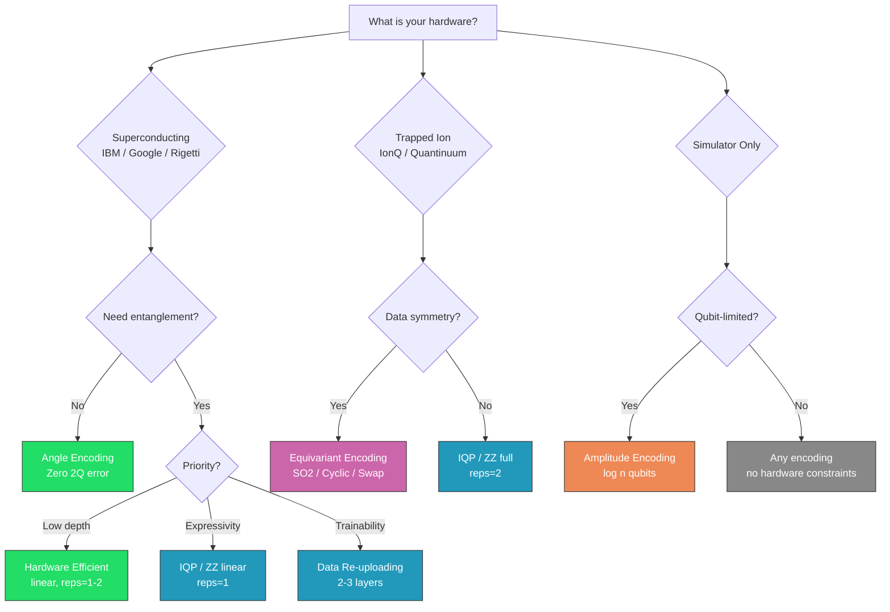

# Hardware Considerations

Quantum encodings that look excellent in simulation may perform poorly on real quantum hardware. This tutorial covers the practical considerations for deploying encodings on NISQ (Noisy Intermediate-Scale Quantum) devices.

!!! abstract "What you'll learn"
    - How noise affects different encoding architectures
    - Choosing encodings for specific hardware topologies
    - Trading expressibility for noise resilience

---

## The NISQ Reality

Current quantum hardware has three fundamental limitations that affect encoding choice:

```
  ┌──────────────────────────────────────────────────────┐
  │  1. Limited qubits       (50-1000 qubits)            │
  │  2. Noisy gates          (error rates ~10⁻³ to 10⁻²) │
  │  3. Limited connectivity (not all-to-all)             │
  └──────────────────────────────────────────────────────┘
```

---

## Noise and Circuit Depth

Two-qubit gates (CNOTs) are 5-10x noisier than single-qubit gates. The total error accumulates roughly as:

```
  P(success) ≈ (1 - ε₁)^{n₁} × (1 - ε₂)^{n₂}

  where:
    ε₁ ≈ 10⁻⁴  (single-qubit error rate)
    ε₂ ≈ 10⁻²  (two-qubit error rate)
    n₁, n₂     = number of single/two-qubit gates
```

| Encoding | CNOTs (4 qubits) | Est. Success Rate | Hardware Suitability |
|:---------|:-----------------:|:-----------------:|:-------------------:|
| Angle | 0 | ~99% | Excellent |
| IQP (linear) | 6 | ~94% | Good |
| IQP (full) | 12 | ~89% | Moderate |
| Data Re-uploading | varies | varies | Good (if shallow) |
| Amplitude | ~6 | ~94% | Moderate (depth-limited) |

---

## Connectivity Constraints

Most quantum processors do not have all-to-all qubit connectivity. This means CNOT gates between non-adjacent qubits require SWAP operations, increasing depth.

```
  Full connectivity           Linear connectivity
  (superconducting, ideal)    (most real hardware)

  0 ──── 1                    0 ─── 1 ─── 2 ─── 3
  │ ╲  ╱ │
  │  ╳   │                    CNOT(0,3) requires 2 SWAPs
  │ ╱  ╲ │                    → 6 extra CNOT gates
  3 ──── 2
```

**Practical advice:**

- Use `entanglement='linear'` for IQP/ZZ Feature Map on linear-topology hardware
- Use `entanglement='circular'` if the chip has a ring topology
- Avoid `entanglement='full'` unless transpiler overhead is acceptable

---

## Encoding Recommendations by Hardware

Different quantum hardware platforms have distinct gate sets, connectivity constraints, and error characteristics. The table below maps each encoding family to the platform it is best suited for.

### Superconducting Processors (IBM, Google, Rigetti)

Superconducting chips typically offer **nearest-neighbor connectivity** (linear or heavy-hex lattice) and native gate sets built around single-qubit rotations + CNOT or CZ.

| Encoding | Config | CNOTs (4q) | Depth | Verdict |
|:---------|:-------|:----------:|:-----:|:--------|
| Angle | `rotation='Y'` | 0 | 1 | Best baseline -- zero 2Q error |
| Basis | default | 0 | 1 | Ideal for binary/categorical data |
| Hardware Efficient | `rotation='Z'`, `entanglement='linear'` | 6 | 4 | Designed for this hardware; RZ is virtual (zero error) on many chips |
| Data Re-uploading | `n_layers=2` | 6 | 4 | Good balance of depth and expressivity |
| IQP | `entanglement='linear'`, `reps=1` | 6 | 3 | Provable hardness with manageable depth |
| ZZ Feature Map | `entanglement='linear'`, `reps=1` | 6 | 4 | Pairwise interactions without SWAP overhead |
| QAOA-Inspired | `entanglement='linear'` | 6 | 9 | Native CZ on Google Sycamore |

!!! tip "RZ is free on many superconducting chips"
    On IBM and Google processors, RZ gates are implemented as **virtual Z rotations** (a frame change in software) with zero physical error. Prefer `rotation='Z'` in Hardware-Efficient encoding to eliminate single-qubit gate noise entirely.

### Trapped-Ion Processors (IonQ, Quantinuum)

Trapped-ion systems provide **all-to-all connectivity** and long coherence times, but have slower gate speeds (~100 $\mu$s for two-qubit gates vs. ~200 ns on superconducting hardware).

| Encoding | Config | CNOTs (4q) | Depth | Verdict |
|:---------|:-------|:----------:|:-----:|:--------|
| IQP | `entanglement='full'`, `reps=2` | 24 | 6 | Full expressivity with native all-to-all |
| ZZ Feature Map | `entanglement='full'`, `reps=2` | 24 | 8 | Rich pairwise interactions, no SWAP overhead |
| Pauli Feature Map | `entanglement='full'`, `reps=2` | 24 | 8 | Configurable multi-body Pauli interactions |
| Trainable | `entanglement='full'` | 12 | varies | Learnable parameters for task-adapted maps |
| SO(2) Equivariant | default | varies | varies | Continuous symmetry -- benefits from long coherence |

!!! tip "Depth tolerance on ion traps"
    Ion traps have coherence times 100-1000x longer than superconducting qubits (~1 s vs. ~100 $\mu$s). This means deeper circuits with `entanglement='full'` remain viable even at 20-30 CNOTs, where a superconducting device would suffer significant decoherence.

### Neutral-Atom Processors (QuEra, Pasqal)

Neutral-atom platforms feature reconfigurable connectivity and native multi-qubit gates (CZ, CCZ). They excel at graph-structured problems.

| Encoding | Config | Why |
|:---------|:-------|:----|
| QAOA-Inspired | `entanglement='linear'` or custom | Native cost-mixer structure maps naturally to Rydberg Hamiltonians |
| Hamiltonian | `hamiltonian_type='ising'` | Physics-informed encoding matches native Ising interactions |
| Hardware Efficient | `entanglement='linear'` | Low-depth circuits suit moderate coherence times |

---

## Complete Resource Comparison

The following table summarises the two-qubit gate cost for every encoding at `n_features=4` with default parameters. Two-qubit gates dominate the error budget on all current hardware.

| Encoding | 2Q Gates | 2Q Type | Depth | Total Gates | Entangling |
|:---------|:--------:|:-------:|:-----:|:-----------:|:----------:|
| Angle | 0 | -- | 1 | 4 | No |
| Basis | 0 | -- | 1 | 0-4 | No |
| Higher-Order Angle | 0 | -- | 1 | 4 | No |
| Hardware Efficient (linear, r=2) | 6 | CNOT | 4 | 14 | Yes |
| QAOA-Inspired (linear, r=2) | 6 | CZ | 9 | 22 | Yes |
| Data Re-uploading (L=3) | 9 | CNOT | 6 | 21 | Yes |
| IQP (full, r=2) | 24 | CNOT | 6 | 62 | Yes |
| ZZ Feature Map (full, r=2) | 24 | CNOT | 8 | 56 | Yes |
| Pauli Feature Map (full, r=2) | 24 | CNOT | 8 | 56 | Yes |
| Trainable (linear, r=2) | 6-12 | CNOT | varies | varies | Yes |
| Amplitude | ~2 | CNOT | 16 | 14 | Yes |
| Hamiltonian | varies | CNOT | varies | varies | Yes |
| Symmetry-Inspired | ~12 | CNOT | varies | varies | Yes |
| SO(2) Equivariant | varies | CNOT | varies | varies | Yes |
| Cyclic Equivariant | varies | CNOT | varies | varies | Yes |
| Swap Equivariant | varies | CZ | varies | varies | Yes |

---

## Noise Resilience Analysis

The library includes a noise simulation framework for evaluating how encodings degrade under realistic hardware noise. It uses depolarizing channels at three calibrated noise levels based on published hardware benchmarks (Arute et al., 2019; Preskill, 2018).

### Noise Model

The depolarizing channel replaces a quantum state $\rho$ with the maximally mixed state with probability $p$:

$$\mathcal{E}(\rho) = (1-p)\,\rho + p\,\frac{I}{d}$$

Three noise levels model the spectrum of current hardware:

| Level | 1Q Error Rate ($\varepsilon_1$) | 2Q Error Rate ($\varepsilon_2$) | Representative Hardware |
|:------|:---:|:---:|:---|
| **Low** | 0.1% | 1% | Near-term fault-tolerant, best superconducting qubits |
| **Medium** | 0.5% | 5% | Typical NISQ superconducting or trapped-ion devices |
| **High** | 1.0% | 10% | Noisy NISQ hardware, early prototypes |

### Estimated Fidelity by Encoding

Using the success probability model $P \approx (1-\varepsilon_1)^{n_1} \times (1-\varepsilon_2)^{n_2}$ with the gate counts from the resource table above, we can estimate the encoding fidelity at each noise level:

| Encoding (4 qubits, default config) | Low Noise | Medium Noise | High Noise |
|:-------------------------------------|:---------:|:------------:|:----------:|
| Angle (0 CNOTs, 4 1Q gates) | ~99.6% | ~98.0% | ~96.1% |
| Hardware Efficient (6 CNOTs, 8 1Q gates) | ~93.2% | ~72.0% | ~52.8% |
| Data Re-uploading (9 CNOTs, 12 1Q gates) | ~90.0% | ~63.0% | ~40.5% |
| IQP full (24 CNOTs, 38 1Q gates) | ~75.0% | ~27.8% | ~8.4% |
| ZZ Feature Map full (24 CNOTs, 32 1Q gates) | ~75.5% | ~29.0% | ~9.0% |

!!! warning "Deep circuits degrade rapidly"
    At medium noise levels, encodings with 20+ CNOTs retain less than 30% fidelity. On real hardware, this translates to classification performance approaching random chance. Prefer shallow encodings (`entanglement='linear'`, low `reps`) unless your hardware has error rates at the "Low" tier or below.

### Running Noise Analysis

The library provides tools to compute exact fidelity decay for any encoding by simulating ideal and noisy circuits on PennyLane's density-matrix backend:

```python
from experiments.noise_models import get_noise_params, execute_noisy_circuit, execute_ideal_circuit
from experiments.noisy_analysis import compute_fidelity_decay

from encoding_atlas import IQPEncoding

enc = IQPEncoding(n_features=4, reps=1, entanglement='linear')

# Compute average fidelity decay over 100 random inputs
result = compute_fidelity_decay(enc, noise_level='medium', n_samples=100, seed=42)

print(f"Mean fidelity:  {result['mean_fidelity']:.3f}")
print(f"Fidelity decay: {result['fidelity_decay']:.3f}")
print(f"Min fidelity:   {result['min_fidelity']:.3f}")
print(f"Max fidelity:   {result['max_fidelity']:.3f}")
```

!!! note "Density matrix memory"
    Noisy simulation uses density matrices, which scale as $O(4^n)$ in memory compared to $O(2^n)$ for statevectors. Keep `n_qubits` $\leq$ 8 for reasonable memory usage (256 $\times$ 256 complex128 $\approx$ 1 MB at 8 qubits).

---

## Execution Time Estimation

The library can estimate circuit execution time based on gate counts and configurable gate durations. Default timings reflect typical superconducting hardware:

```python
from encoding_atlas import AngleEncoding, IQPEncoding
from encoding_atlas.analysis import estimate_execution_time

# Superconducting defaults (20 ns 1Q, 200 ns 2Q, 1 μs measurement)
for Enc in [AngleEncoding, IQPEncoding]:
    enc = Enc(n_features=4)
    t = estimate_execution_time(enc)
    print(f"{enc.__class__.__name__:<20s}  "
          f"serial={t['serial_time_us']:.2f} μs  "
          f"estimated={t['estimated_time_us']:.2f} μs")

# Trapped-ion timings (1 μs 1Q, 100 μs 2Q)
enc = IQPEncoding(n_features=4, reps=2)
t = estimate_execution_time(
    enc,
    single_qubit_gate_time_us=1.0,
    two_qubit_gate_time_us=100.0,
)
print(f"IQP on ion trap: {t['estimated_time_us']:.0f} μs")
```

---

## Encoding Selection Flowchart

Use this decision tree to choose an encoding based on your target hardware:



---

## Next Steps

- [Comparing Encodings](comparing-encodings.md) — property-level comparison
- [Benchmarking](benchmarking.md) — full classification benchmarks
- [Encodings Reference](../encodings/index.md) — per-encoding hardware notes
